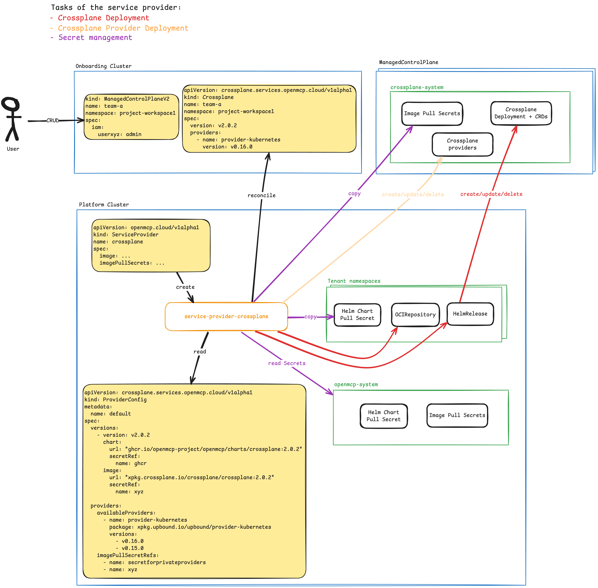

# How does the Service Provider Crossplane work?

The Service Provider Crossplane is responsible for managing Crossplane instances and Crossplane providers within a `ManagedControlPlane`. It achieves this by reconciling `Crossplane` resources, which define the desired state of Crossplane installations.

The service-provider-crossplane has three main tasks:
1. Deploy Crossplane (via Helm Chart) into the `ManagedControlPlane` cluster.
2. Deploy Crossplane Providers (via Crossplane's `Provider` resource) into the `ManagedControlPlane` cluster.
3. Copy Secrets from the Platform cluster to either specific namespaces in the Platform cluster or to the `ManagedControlPlane` cluster.

The following diagram illustrates the architecture and workflow of the Service Provider Crossplane:

NOTE: The diagram is a simplified representation and may not include all components or interactions.

Under the hood, service-provider-crossplane uses [FluxCD](https://fluxcd.io/) to deploy Crossplane on the `ManagedControlPlane` cluster.
It uses Flux' `OCIRepository` and `HelmRelease` APIs to manage the lifecycle of the Crossplane installation.
This also means that the Service Provider Crossplane solely supports OCI registry based Helm charts for Crossplane installations.

